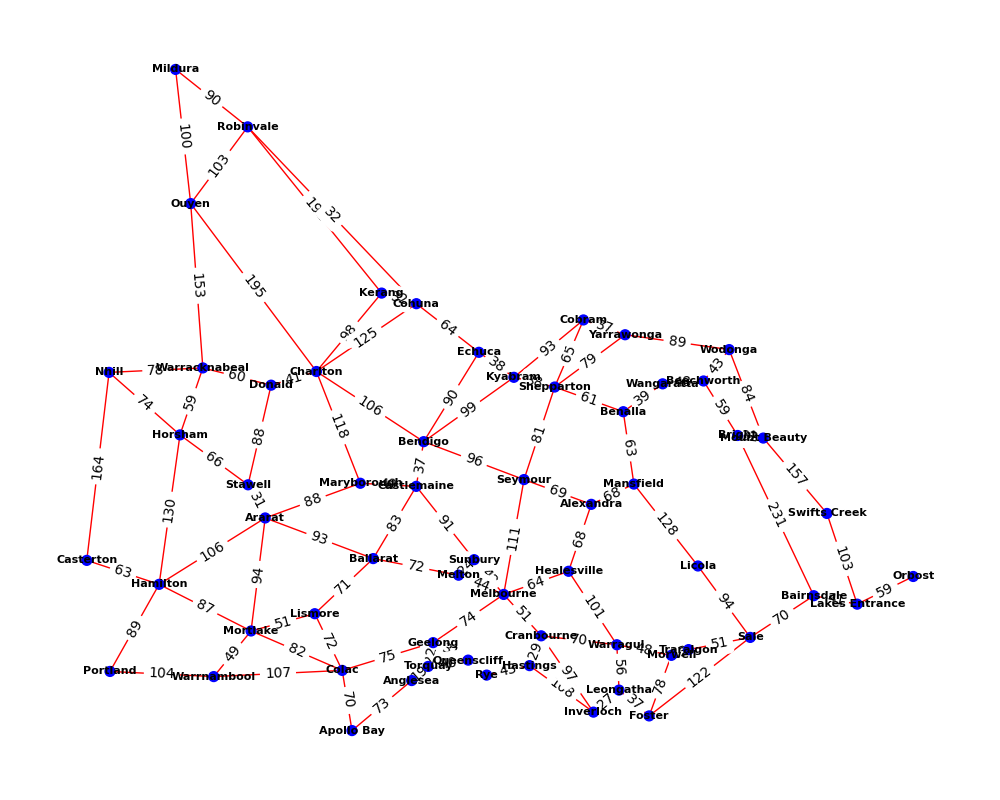

# VSV VCE Algorithmics SAT U3 #
Task 1: **Radius Repellent**  
(The sanitation team must traverse every road within a given radius and spray it with Pangobat repellent in the shortest possible time.)  
  
Task 2: **Radius Vaccination**  
The medical team must visit every town within a given radius and vaccinate everybody in the shortest possible time.  

### Table of Contents ###
1. [Model and Specification](#part-1-model-and-specification)
2. [Design your Algorithm](#part-2-design-your-algorithm)
3. [Implementation](#part-3-implementation)
4. [Evaluation](#part-4-evaluation)

## 0. Aim and Introduction ##
The following report outlines the design and implementation of two algorithms to address real-world problems faced by the Sanitation and Medical Teams in a fictional urban environment. The goal is to develop sutable algorithms to combat the spread of "Pangobats", Making use of efficient algorithmic decsign to optimize the task.

## Part 1: **Model and Specification** ##
### 1.1 Model ###
The Sanitation and Medical Teams are tasked with traversing a network of towns and roads to spray Pangobat repellent and administer vaccines to the residents. s. This network is visualized as a large connected graph, where towns are nodes and roads are edges. Each node contains essential information like location coordinates, population density, average income, and average age. The edges, which represent roads, are weighted based on the straight-line distance needed for travel. Multiple edges can stem from a single node, indicating multiple roads leading out of a town; all these edges are treated as undirected for simplicity. To accurately calculate distances between towns based on latitude and longitude coordinates, the `haversine()` function should be used to account for the curvature of the Earth. Node attrubutes like population density, average income, and average age are used to determine the priority of each town for vaccination or repellent spraying, they are available for retreival using `<town>.<attribute-name>`.

### 1.2 Task Specification ###
The Sanitation and Medical Teams are tasked with two problems. To treverse each road within a given radius and spray it with Pangobat repellent in the shortest possible time, and to visit every town within a given radius and vaccinate everybody in the shortest possible time. These tasks are commonly known as Travelling Salesman Problems (TSP) and Chinese Postman Problems (CPP), respectively. These algorithms are designed to optimize the routes taken by the teams to minimize travel time and resource usage, They should be designed in this instance to also take into account relevent real world information provided.

### 1.3 Real World Considerations ###
The Sanitation and Medical Teams must consider several real-world factors when designing their algorithms. For the Sanitation Team, the repellent must be sprayed in a timely manner to prevent the spread oe Pangobats and should therefor make use of the `time` node attribute as well as `distance`. The algorithm must prioritize towns based on population density as outbreaks will be more common, income -- Low income towns are more at risk for outbreaks, and age -- The elderly are more at risk fot disease.

### 2. Radius Vaccination ### 
This second task requires the Medical Team to visit every town within a given radius and vaccinate all residents. The problem is similar to the first, but with different constraints and objectives. This problem is of paramount importance in scenarios like mass vaccination campaigns, where timely and comprehensive coverage can significantly impact public health outcomes, similar to what was seen in the COVID pandemic. To model this real-world problem effectively, several key features need consideration.

As with the first task, a Graph ADT will be used to represent the town network, with each town as a Node and each road as an Edge. Each node will include attributes like location coordinates, population density, average income and average age. The edges will contain data like distance and time required for traversal. This information is vital for route planning and resource allocation and provides the basis for optimising routes abd minimising travel time. Furthermore, the algorithm must account for the vaccination process itself. A priority queue ADT is introduced to manage the order of towns to be visited based on factors like population density, urgency of vaccination (derived from median age and income), and travel distances. This ensures that high-priority locations are addressed promptly, optimizing the overall vaccination schedule

### 3. ADT Signitures ###
- Priority Queue
    - **enqueue**: element, int -> Priority Queue
    - **dequeue**: Priority Queue -> element
    - **isEmpty**: Priority Queue -> bool
- Set
    - **add**: element, Set -> Set
    - **remove**: element, Set -> Set
    - **contains**: element, Set -> bool
    - **length**: Set -> int

## Part 2: **Design your Algorithm** ##
### 2.1 Visiting all towns within a given radius ###
Visiting every node within a given radius is a decivingly simple problem, This genre of problem is generally known as a Travelling Salesman Problem (TSP). The problem is to find the shortest possible route that visits every node in a graph exactly once and returns to the starting node. The problem is further complicated by the fact that the graph is weighted, meaning that the distance between nodes is not uniform, This is then combined with the radius of towns taking into account the curviture of the Earth. The algorithm must be designed to take into account the distance between nodes, as well as the population density, average income, and average age of each town.

The first step the algorithm must take is to determine the relevent towns within the specified radius. This can either be completed using a depth first search (DFS) or a breadth first search (BFS), In this situation BFS is more optimal as it explores level by level, this ensures all nodes within the radius are captured and is quicker for nearby nodes and small radiuses. This will return a list of towns (Nodes) within the radius, which can then be used to calculate the shrotest Hamiltonian path that visits all towns in the list.

Then the algorithm must calculate the shortest Hamiltonian path that visits all towns in said list. To do this a number of approches can be taken, the simplest being a brute force approach, which calculates the distance of every possible path and returns the shortest. This is not optimal for even quite small datasets, as the number of possible paths grows factorially with the number of towns (ie 1, 2, 6, 24, 120, 720, 5040, 40320...) and this is simply not practically possible on large datasets even with the most powerful computers. A more optimal approach is to use a heuristic algorithm such as the Nearest Neighbour Algorithm, which starts at a random node and then moves to the nearest node, this is repeated until all nodes are visited. This is a simple and effective algorithm, although it is not always optimal, as it can ge stuck in local minima, where the algorithm gets stuck at the lowest point within a neighbourhood but is not neccaserrally the lowest point overall.

### 2.2 Visiting all roads within a given radius ###

## Part 3: **Implementation** ##

## Part 4: **Evaluation** ##

note to self:
- Team must return to bendigo
